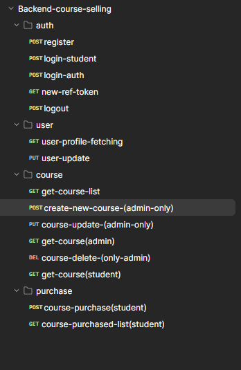

# Course Selling Backend

Production‑level backend built with Node.js, Express.js, and MongoDB.

## Features

* JWT authentication with access & refresh tokens
* Role-based access (admin/student)
* Courses with Cloudinary thumbnails/videos
* Temporary uploads are stored in `/uploads` before sending to Cloudinary and removed afterwards
* Purchase system with records
* Centralized error handling using ApiError/ApiResponse
* Clean MVC architecture and utilities

## Getting Started

1. **Install dependencies**
   ```bash
   npm install
   ```

2. **Configure environment**
   - Rename `.env.example` to `.env` and fill in values.

3. **Run server**
   ```bash
   npm run dev
   ```

4. **API Endpoints**
   - `POST /api/auth/register` — register
   - `POST /api/auth/login` — login
   - `GET /api/auth/refresh` — refresh access token
   - `POST /api/auth/logout` — logout
   - `GET /api/users/me` — profile
   - `PUT /api/users/me` — update profile
   - `GET /api/courses` — list courses
   - `GET /api/courses/:id` — course details
   - `POST /api/courses` — create (admin)
   - `PUT /api/courses/:id` — update (admin)
   - `DELETE /api/courses/:id` — delete (admin)
   - `POST /api/purchases/:courseId` — purchase course
   - `GET /api/purchases` — list my purchases

See source code for request/response formats.

---

*Example responses follow standardized structure:* 
```json
{
  "success": true,
  "message": "...",
  "data": {...}
}
```

post-man paths
(all paths tested)


